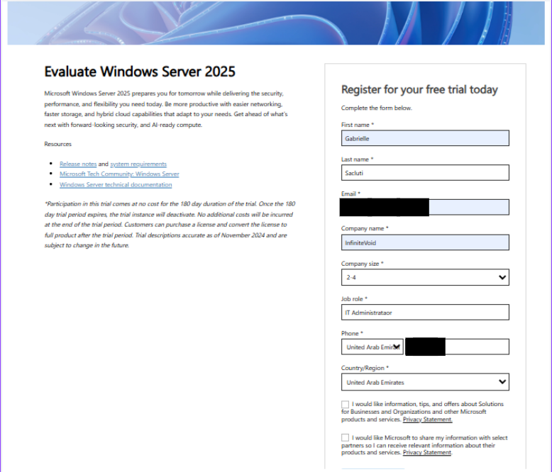
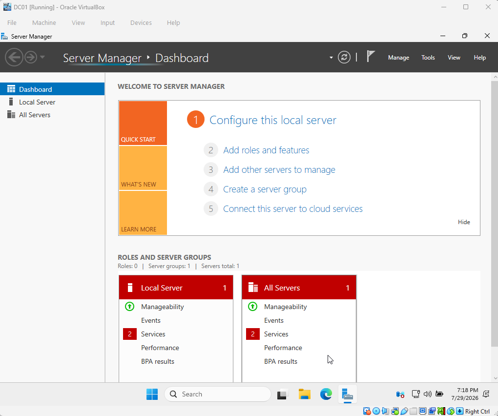
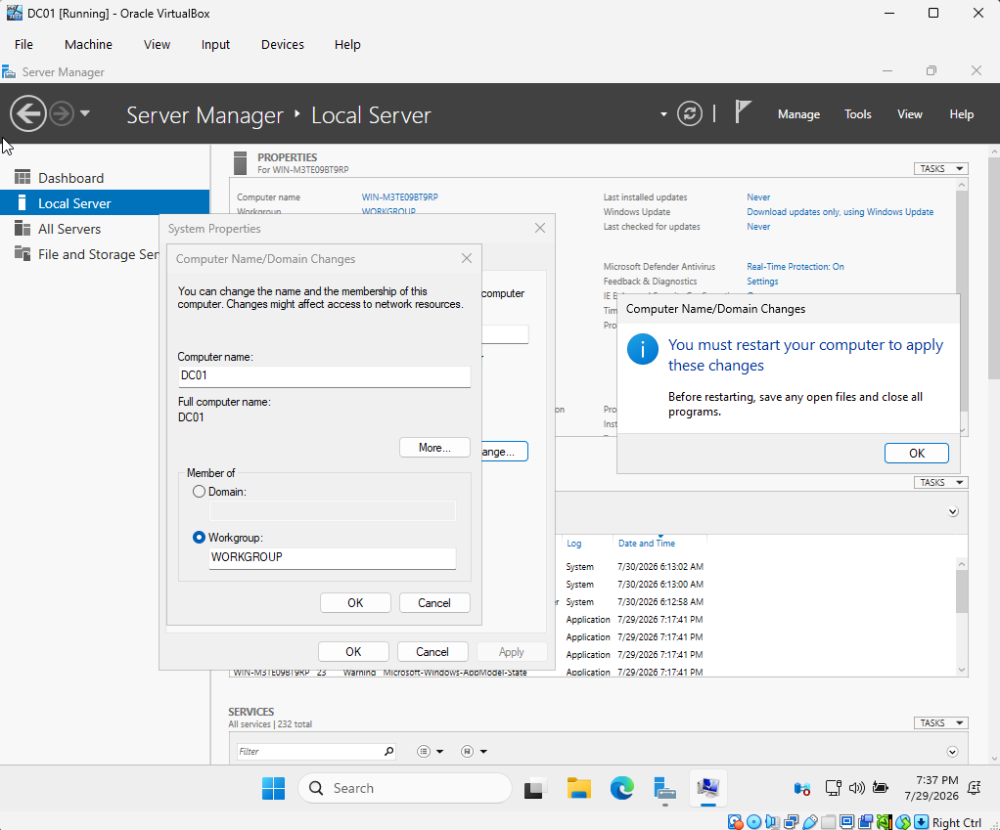
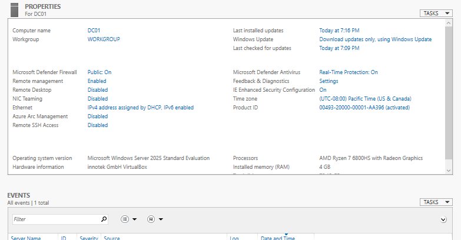
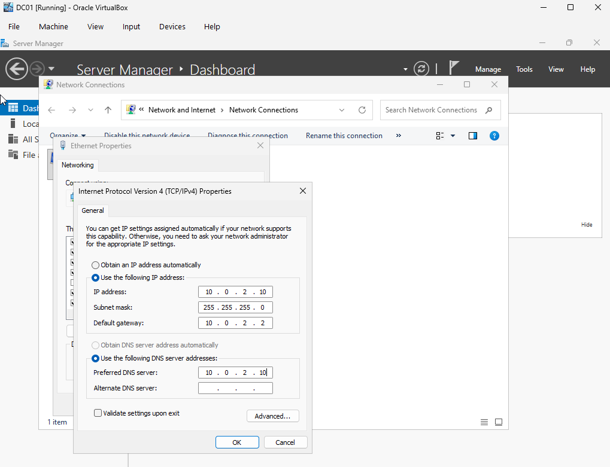
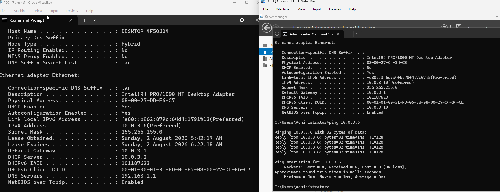

# Phase 1 — Installation and Networking

[Project overview](../READme.md) · [Next: Active Directory](phase2.md)

**Status:** Installation and connectivity work recorded as complete. The Windows client domain-join walkthrough remains to be documented separately.

## Step 1: Download the prerequisites

This lab uses Windows Server 2025 Evaluation, Windows 11 Enterprise Evaluation, and Oracle VirtualBox. See [Prerequisites](Prerequisites.md) for download links.

The original notes said Server 2022; the saved download screenshot identifies Server 2025, matching the prerequisites and Phase 2.



## Step 2: Install the virtual machines

Create a server VM and a Windows 11 client VM, attach their installation ISOs, and complete Windows setup. The server will become DC01; the client is referred to as PC01 throughout this project.

| Machine | Initial local account |
| --- | --- |
| Windows Server | `Administrator` |
| Windows 11 | `Admin` |

Choose passwords during setup and store them privately. Literal passwords from the original notes have been replaced with this instruction.

The original walkthrough does not record VM memory, CPU, disk allocations, or all installation choices; add these when documenting reproducibility.



## Step 3: Rename the server to DC01

1. Open **Server Manager > Local Server**.
2. Select the current computer name, then **Change**.
3. Set the computer name to `DC01`.
4. Restart the server to apply the change.





## Step 4: Configure the VirtualBox network

This lab uses **NAT Network** so the VMs can communicate with one another and make outbound connections without being bridged directly onto the home LAN. This is not complete isolation from external networks. See Oracle's [NAT service documentation](https://www.virtualbox.org/manual/ch06.html#network_nat_service).

1. Shut down both VMs.
2. In VirtualBox's network settings, create or select the shared NAT Network for the lab.
3. In each VM's **Settings > Network**, enable its adapter and select **NAT Network**.
4. Select the same network name for both VMs and ensure the virtual cable is connected.
5. Start both VMs.

The recorded address plan uses `10.0.3.0/24` with gateway `10.0.3.1`. Confirm the NAT Network matches that plan and keep DC01's static address outside any DHCP allocation range. The original notes do not record the network name or DHCP range.

## Step 5: Configure DC01's static IPv4 address

Run the following in Command Prompt to inspect the initial configuration:

```cmd
ipconfig /all
```

Open the Ethernet adapter's properties and select **Internet Protocol Version 4 (TCP/IPv4)**. Apply the recorded settings:

| Setting | Value |
| --- | --- |
| IP address | `10.0.3.10` |
| Subnet mask | `255.255.255.0` |
| Default gateway | `10.0.3.1` |
| Preferred DNS server | `10.0.3.10` |

DC01 needs a predictable address for clients to locate its services. Its own DNS service is installed in Phase 2; DNS resolution through `10.0.3.10` is not expected to work before that service is available. PC01 will also need to use the AD DNS server before joining the domain.



## Step 6: Verify connectivity and troubleshoot ICMP

Run `ipconfig /all` on both VMs. Check their addresses, subnet masks, and gateways; different address prefixes on the host and VMs alone do not prove connectivity.

From each VM, test the gateway:

```cmd
ping 10.0.3.1
```

From the client, test DC01:

```cmd
ping 10.0.3.10
```

From DC01, ping the client's actual IPv4 address shown by `ipconfig /all`.

**Recorded result:** Both VMs could reach the gateway, but initial pings between them timed out. The VirtualBox settings were checked, and allowing inbound ICMP echo requests resolved the issue.

For a repeatable test, enable only the required ICMPv4 Echo Request inbound rule for the applicable firewall profile and lab scope. Keep the firewall enabled. The original notes do not identify the exact rule or scope used.



## Outcome

The notes record completed VM setup, DC01 naming, static networking, and successful connectivity troubleshooting. Continue with [Phase 2](phase2.md) to install AD DS and DNS.
