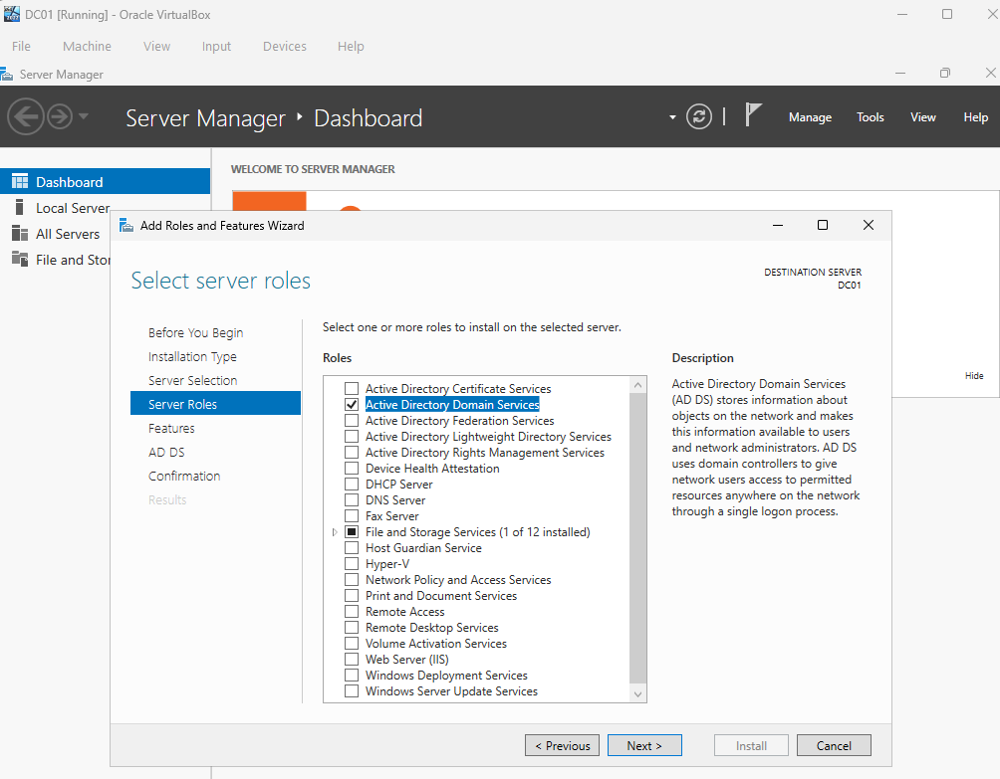
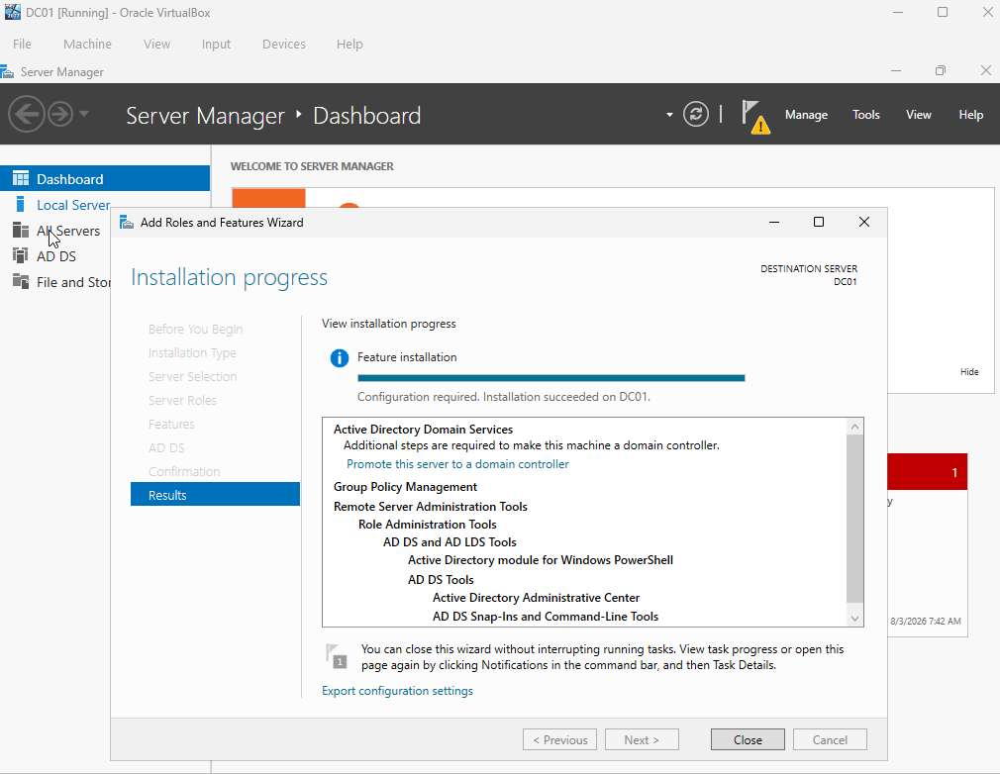
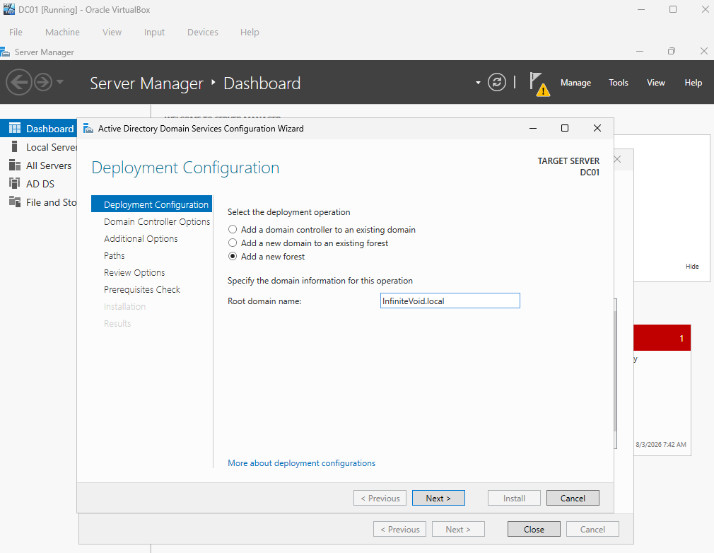
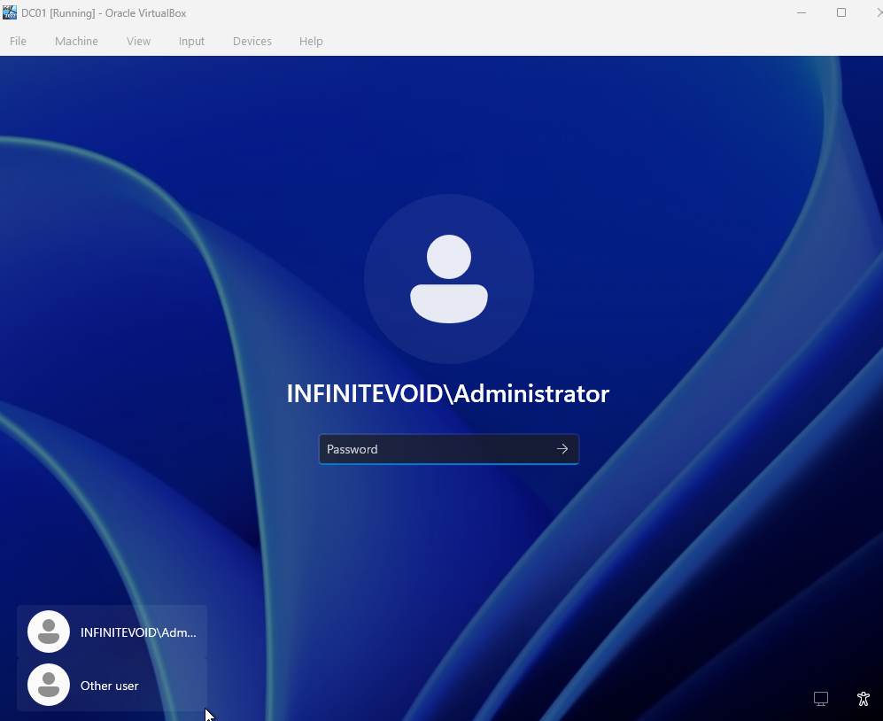
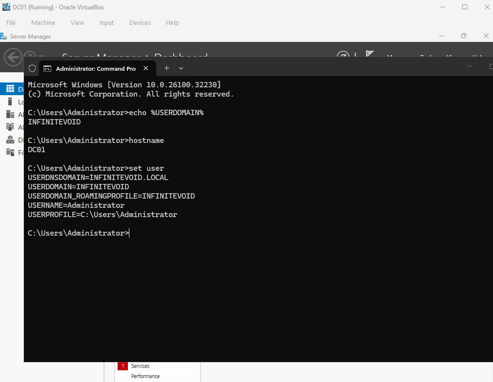
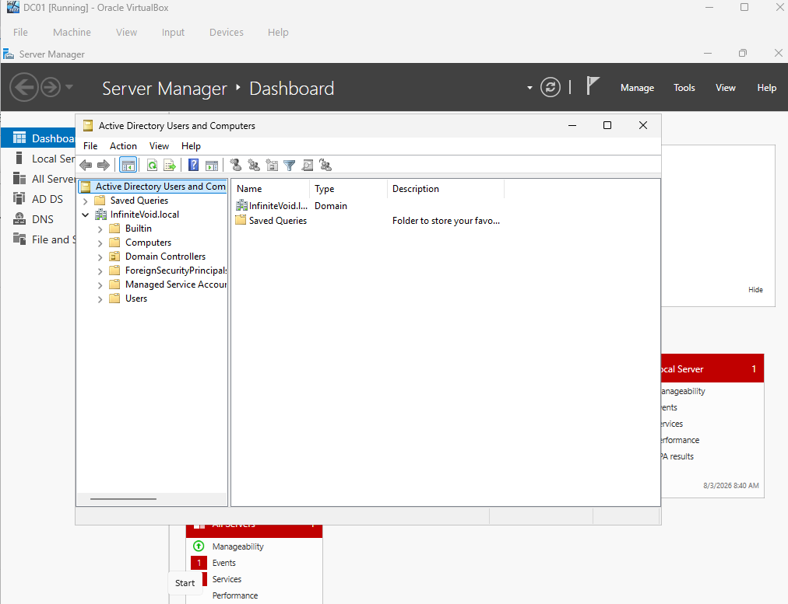

# Phase 2 — Active Directory Domain Services

[Project overview](../READme.md) · [Previous: Installation and networking](phase1.md) · [Next: Users and Group Policy](phase3.md)

**Status:** Domain controller deployment and initial verification recorded as complete.

## Prerequisites

Complete Phase 1. DC01 should have its final hostname and static address, `10.0.3.10`. Sign in using the local `Administrator` account before promotion.

## Step 1: Install the AD DS role

Active Directory Domain Services stores directory objects such as users, groups, and computers and supports domain authentication and administration.

1. Open **Server Manager > Manage > Add Roles and Features**.
2. Choose **Role-based or feature-based installation**.
3. Select `DC01` as the destination server.
4. Select **Active Directory Domain Services**, then **Add Features** when prompted.
5. Continue through the Features and AD DS information pages.
6. Review the selection and select **Install**. Automatic restart was left unchecked in this lab.
7. Wait for successful installation, then select **Promote this server to a domain controller** from the result page or Server Manager notification.

Role installation and domain controller promotion are separate steps. The installation wizard can be closed without interrupting the background installation, as noted on its result page.





## Step 2: Create the forest and promote DC01

1. In **Deployment Configuration**, select **Add a new forest**.
2. Enter `InfiniteVoid.local` as the root domain name.
3. Configure the Domain Controller Options using the settings recorded below.



| Option | Recorded setting |
| --- | --- |
| Forest functional level | Windows Server 2025 |
| Domain functional level | Windows Server 2025 |
| DNS server | Selected |
| Global Catalog | Selected |
| Read-only domain controller | Not selected |

Use the functional levels supported by the installed server version; the values above are from the lab notes.

Set a separate **Directory Services Restore Mode (DSRM)** password and store it privately. This recovery credential is distinct from the account used for normal domain sign-in. The literal password has been omitted from this document.

A DNS delegation warning was recorded. For this standalone lab forest, no parent DNS delegation was configured. Review warnings in context; a delegation warning does not mean all prerequisite warnings can be ignored. Microsoft describes these options in the [AD DS Configuration Wizard reference](https://learn.microsoft.com/en-us/windows-server/identity/ad-ds/deploy/ad-ds-installation-and-removal-wizard-page-descriptions).

Continue with these settings:

| Setting | Value |
| --- | --- |
| NetBIOS domain name | `INFINITEVOID` |
| Database folder | `C:\Windows\NTDS` |
| Log files folder | `C:\Windows\NTDS` |
| SYSVOL folder | `C:\Windows\SYSVOL` |

Review the configuration, run the prerequisite checks, and resolve errors before selecting **Install**. Promotion configures AD DS and DNS and restarts the server.

After restart, sign in as `INFINITEVOID\Administrator` using the Administrator account password, not the DSRM password.



## Step 3: Verify the initial deployment

In **Command Prompt**, run:

```cmd
echo %USERDOMAIN%
hostname
```

Expected values are `INFINITEVOID` and `DC01` respectively. These identify the sign-in domain and hostname; they are not a full AD health check.



Open **Server Manager > Tools** and check for the installed administrative tools:

* Active Directory Users and Computers
* Active Directory Administrative Center
* Active Directory Domains and Trusts
* Active Directory Sites and Services
* DNS
* Group Policy Management

Open **Active Directory Users and Computers** (`dsa.msc`) and expand `InfiniteVoid.local`. The initial directory includes the `Builtin`, `Computers`, and `Users` containers, plus the `Domain Controllers` OU. Containers and OUs are different object types.



## Outcome

The notes record DC01 promotion, domain sign-in, and initial directory verification. DNS was installed with AD DS; separate DNS resolution and domain health test results have not yet been recorded. Continue with [Phase 3](phase3.md) to create users, groups, and policies.
