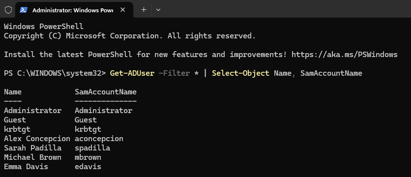
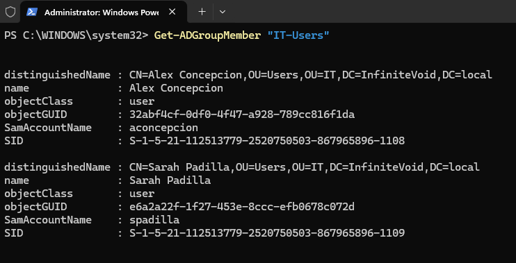
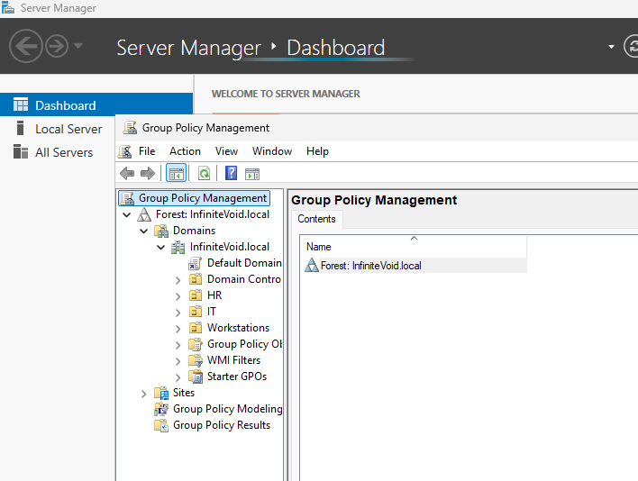
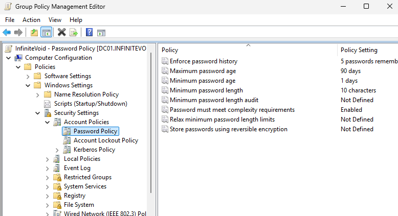
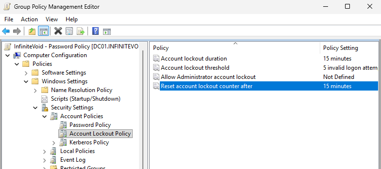
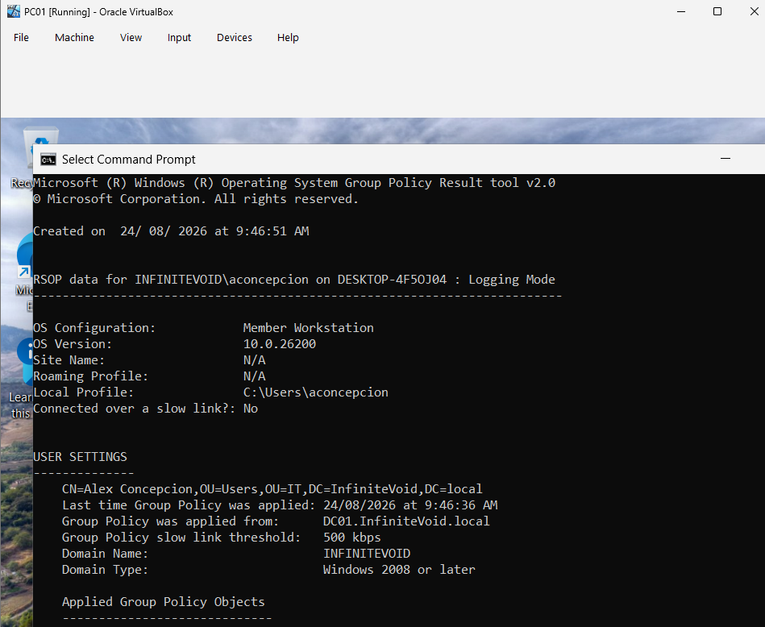
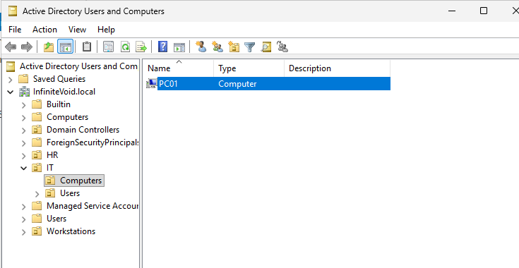

# Phase 3 — User Administration and Initial Group Policy

[Project overview](../READme.md) · [Previous: Active Directory](phase2.md)

**Status:** In progress. User and group administration, policy configuration, and PC01 organization are recorded. Effective password-policy and lockout validation remain outstanding.

This phase includes Group Policy work originally planned for Phase 5. Client testing assumes that the Windows 11 VM has already joined the domain; the join procedure still needs its own Phase 4 walkthrough.

## Step 1: Open Active Directory Users and Computers

Sign in to DC01 as `INFINITEVOID\Administrator`. Press **Win + R**, enter `dsa.msc`, and expand `InfiniteVoid.local`.

OUs organize directory objects and provide locations for linking GPOs and delegating administration. Security groups collect accounts for permission assignments. Creating an OU or adding a user to a department group does not itself grant access to shared resources.


## Step 2: Create departmental OUs

Right-click the domain and select **New > Organizational Unit**. Create these three custom top-level OUs:

* `IT`
* `HR`
* `Workstations`

The domain's existing top-level `Users` object is a built-in container, not a fourth custom OU. No additional top-level `Users` OU is shown in the saved hierarchy.

## Step 3: Create sub-OUs

Within both `IT` and `HR`, create `Users` and `Computers` OUs. The custom hierarchy is:

```text
InfiniteVoid.local
├── IT
│   ├── Users
│   └── Computers
├── HR
│   ├── Users
│   └── Computers
└── Workstations
```


Separating users and computers allows their policy settings and administration to be organized independently. GPOs are linked to sites, domains, or OUs; they are not linked directly to individual users or security groups. Security filtering can narrow which users or computers apply a GPO. See Microsoft's [Group Policy processing documentation](https://learn.microsoft.com/en-us/windows-server/identity/ad-ds/manage/group-policy/group-policy-processing).

In this lab, PC01 is ultimately placed in `IT/Computers`. The separate `Workstations` OU is not used for PC01 in the recorded work.

## Step 4: Create domain users

Right-click the appropriate departmental `Users` OU and select **New > User**. Enter the name and logon name, use the `@InfiniteVoid.local` UPN suffix, and set an initial password privately.

| Name | Logon name (SamAccountName) | OU |
| --- | --- | --- |
| Alex Concepcion | `aconcepcion` | `IT/Users` |
| Sarah Padilla | `spadilla` | `IT/Users` |
| Michael Brown | `mbrown` | `HR/Users` |
| Emma Davis | `edavis` | `HR/Users` |

Alex's logon name is corrected to match the saved PowerShell verification screenshot.


**Recorded lab choices:** The notes used a shared example password, selected **Password never expires**, and cleared **User must change password at next logon**. Literal passwords are omitted here. These choices describe the original exercise, not a general account provisioning standard.

**Follow-up for expiration testing:** Accounts with **Password never expires** selected will not demonstrate the 90-day maximum password age configured later. Clear that option on a designated test account before testing expiration, and record the change. This has not been recorded as completed.


## Step 5: Create security groups

Right-click each departmental OU and select **New > Group**.

| Group | Location | Scope | Type |
| --- | --- | --- | --- |
| `IT-Users` | `IT` | Global | Security |
| `HR-Users` | `HR` | Global | Security |

These groups will support permission assignments in later work. Resource permissions have not yet been configured in this phase.

## Step 6: Add group members

Open each group's **Properties > Members > Add**, select the accounts, and confirm:

| Group | Members |
| --- | --- |
| `IT-Users` | Alex Concepcion, Sarah Padilla |
| `HR-Users` | Michael Brown, Emma Davis |


## Step 7: Verify users and membership

Open PowerShell as Administrator on DC01. The recorded user query is:

```powershell
Get-ADUser -Filter * | Select-Object Name, SamAccountName
```

The screenshot shows all four lab users alongside the built-in accounts.



Check IT group membership:

```powershell
Get-ADGroupMember -Identity 'IT-Users'
```



Additional verification to record for HR:

```powershell
Get-ADGroupMember -Identity 'HR-Users'
```

## Step 8: Configure password and account lockout policy

### Create the domain-linked GPO

1. Press **Win + R** and enter `gpmc.msc`.
2. Expand **Forest: InfiniteVoid.local > Domains > InfiniteVoid.local**.
3. Right-click the domain and select **Create a GPO in this domain, and Link it here**.
4. Name it `InfiniteVoid - Password Policy`.



The lab uses a separate GPO. For domain account policy, it must be linked at the domain root and take precedence over conflicting settings in the Default Domain Policy. Verify the domain link order and effective settings; creating the GPO alone does not establish that it wins. This precedence check remains to be recorded. See Microsoft's [account policy guidance](https://learn.microsoft.com/en-us/previous-versions/windows/it-pro/windows-10/security/threat-protection/security-policy-settings/account-policies).

### Configure password settings

Right-click the GPO, select **Edit**, and navigate to:

**Computer Configuration > Policies > Windows Settings > Security Settings > Account Policies > Password Policy**.

The saved screenshot records these exercise settings:

| Policy | Setting |
| --- | --- |
| Enforce password history | 5 passwords remembered |
| Maximum password age | 90 days |
| Minimum password age | 1 day |
| Minimum password length | 10 characters |
| Password must meet complexity requirements | Enabled |



### Configure account lockout settings

Under **Account Policies > Account Lockout Policy**, configure:

| Policy | Setting |
| --- | --- |
| Account lockout threshold | 5 invalid logon attempts |
| Account lockout duration | 15 minutes |
| Reset account lockout counter after | 15 minutes |



### Recorded client policy check

The notes describe signing in to the Windows 11 VM as Alex and refreshing policy. In Command Prompt, use:

```cmd
gpupdate /force
gpresult /r
```



The saved result shows `INFINITEVOID\aconcepcion`, Alex's `IT/Users` OU, and policy processing from DC01. The visible section is **User Settings**; it does not establish that the domain password and lockout settings are effective.

The VirtualBox window is labeled `PC01`, but the Windows computer name in this report is `DESKTOP-4F5OJ04`. A later ADUC screenshot shows a `PC01` computer object. Verify the current client hostname and document the rename/join sequence; a VM label does not rename the Windows guest.

### Additional validation to perform

These checks are added as follow-up instructions; their results have not yet been captured in the lab.

On DC01, verify GPO link precedence, refresh computer policy with `gpupdate /force`, and then run in PowerShell:

```powershell
Get-ADDefaultDomainPasswordPolicy -Identity 'InfiniteVoid.local' |
    Select-Object ComplexityEnabled, MinPasswordLength, PasswordHistoryCount,
        MinPasswordAge, MaxPasswordAge, LockoutThreshold,
        LockoutDuration, LockoutObservationWindow

Get-ADUserResultantPasswordPolicy -Identity 'aconcepcion'

Get-ADUser -Identity 'aconcepcion' -Properties PasswordNeverExpires |
    Select-Object SamAccountName, PasswordNeverExpires
```

Compare the domain policy output with the tables above. The [default-domain policy command](https://learn.microsoft.com/en-us/powershell/module/activedirectory/get-addefaultdomainpasswordpolicy?view=windowsserver2025-ps) retrieves the domain's default settings. The [resultant-password-policy command](https://learn.microsoft.com/en-us/powershell/module/activedirectory/get-aduserresultantpasswordpolicy?view=windowsserver2025-ps) checks for a fine-grained password policy applying to Alex; if it returns none without an error, use the domain default policy for comparison.

On the client, record `hostname` and `whoami`. To inspect computer-side GPO processing, run `gpresult /scope computer /r` from an elevated Command Prompt. Treat this as supporting evidence alongside the domain policy query.

Use a dedicated non-administrator test account to record password-change acceptance/rejection and lockout behavior. Keep DC01 available for recovery. Record expected and actual outcomes before marking this phase complete.

## Step 9: Organize PC01 in Active Directory

On DC01, open `dsa.msc` and locate the `PC01` computer account in the domain's built-in **Computers** container. Right-click it, select **Move**, and choose **IT > Computers**.

The saved screenshot shows `PC01` in that OU:



The original container will be empty only if no other computer accounts remain there. Moving the AD object changes its OU location; it does not rename the Windows client.

## Remaining work

* Document the Windows client rename, DNS setup, domain join, and authentication in Phase 4.
* Reconcile the earlier client hostname with the later PC01 computer object.
* Record the GPO precedence and effective domain account policy checks.
* Record controlled password and lockout test outcomes, accounting for the initial non-expiring user setting.
* Continue with additional client policies in Phase 5, file services in Phase 6, and automation in Phase 7.
