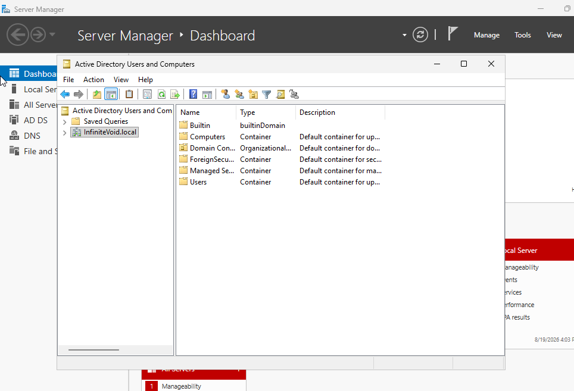
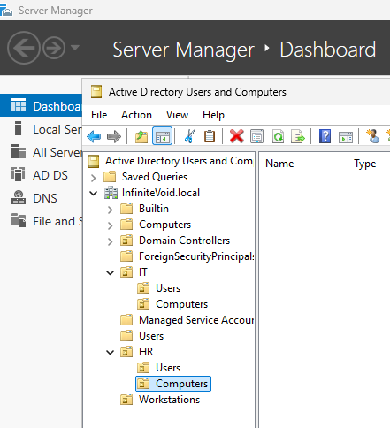
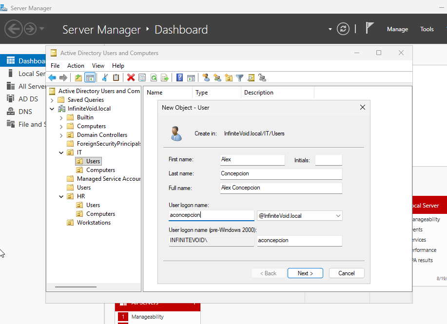
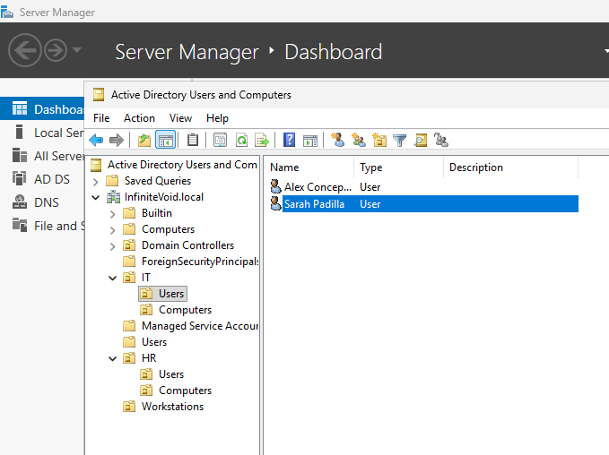
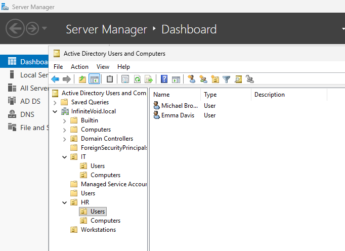
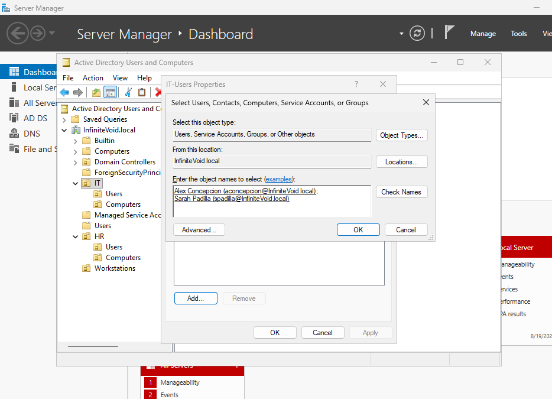
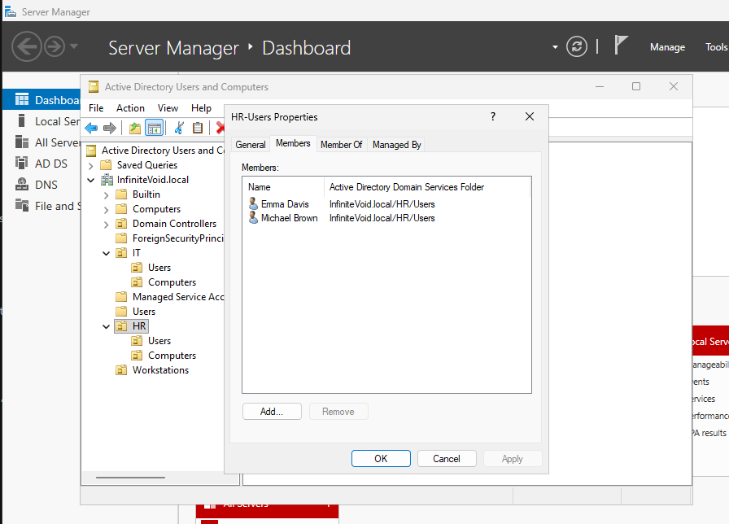

# PHASE 3

STEP 1: Implement Windows Server Administration and Group Policy.

    # Why do we need to implement Group Policy?
  
    # We need to implement Group Policy, because an enterprise is divided into different teams and groups,
    for example, we have an IT group, HR, and different workstations, each of these groups have different 
    levels of access or privilege and rules, which helps with Identity and Access Management (IAM), and enhance security.

    # Log-in into DC01, and log-in as "INFINITEVOID\Administrator"

    # Open Active Directory Users and Computers by pressing "Win + R", and then type "dsa.sc"

    # Then, we find the domain we have just created, which is "infinitevoid.local"

    

STEP 2: Create Organizational Units

    # We right click "infinitevoid.local" domain and then left-click on "New", then "Organizational Unit". We then name the OU's name.

    # We created 4 Organizational Units namely: "IT", "HR", "Users", and "Workstations". We will create the "Users" OU later, as AD has already has it as default container.

STEP 3: Create Sub-Organizational Units

    # After we have created our Organizational Units, we then create our sub-Organizational Units, in this scenario, we created "Users" and "Computers in both "IT" and "HR departments".

    

    # Why do we need Sub-Organizational Units if we have already seperated them in the first place?

    # We need to seperate and create Sub-Organizational Units because we also need to seperate each user's policies. So from a policy to a group, to a policy to each individual in that group.

STEP 4: Create our first user

    # Head to "Users" in "IT", and click "New" then "User", then create our first user, lets name him "Alex" and Surname is "Concepcion".

    

    # We will then set Alex Concepcion's password for his account, for the sake of this lab, we will check "password never expires" option and uncheck the "User must change password at next logon." Do not use this option in real life, and keep the other option checked always instead.

    # Alex Concepcion's Credentials:

    First Name: Alex
    Last Name: Concepcion
    Full Name: Alex Concepcion
    user logon Name: aconcepction 
    domain: @InfiniteVoid.local

    Password: P@ssword123 (WARNING: NEVER USE GENERIC PASSWORDS IN REAL LIFE SCENARIO!)

    # We repeat the process for creating the second IT user, in which we will name "Sarah" with a Surname of "Padilla".

    # Sarah Padilla's Credentials:

    First Name: Sarah
    Last Name: Padilla
    Full Name: Sarah Padilla
    use logon Name: spadilla
    domain: @InfiniteVoid.local

    Password: P@ssword123 (WARNING: NEVER USE GENERIC PASSWORDS IN REAL LIFE SCENARIO!)

    

    # We then head over tothe HR department and repeat the same process.

    # Michael Brown's Credentials:

    First Name: Michael
    Last Name: Brown
    Full Name: Michael Brown
    use logon Name: mbrown
    domain: @InfiniteVoid.local

    Password: P@ssword123 (WARNING: NEVER USE GENERIC PASSWORDS IN REAL LIFE SCENARIO!)

    # Emma Davis' Credentials:

    First Name: Emma
    Last Name: Davis
    Full Name: Emma Davis
    use logon Name: edavis
    domain: @InfiniteVoid.local

    Password: P@ssword123 (WARNING: NEVER USE GENERIC PASSWORDS IN REAL LIFE SCENARIO!)

    

STEP 5: Create Security Groups

    # We create security groups so we can manage permissions more efficiently.

    # Go to the "IT" section in "Organizational Units", right-click "IT" and select "New", then select "Group".

    Group Name: IT-Users
    Group Scope: Global
    Group Type: Security

    # Do the same for the "HR" Department's Organizational Unit.

    Group Name: HR-Users
    Group Scope: Global
    Group Type: Security

STEP 6: Add the users to their respective groups

    # After creating the users and their groups, we then assign them to their specific groups.

    # Head to "IT-Users" section, then right-click "Properties", then "Members", then "Add".

    #We then type the IT users we want to assign the group into, which is "Alex Concepcion" and "Sarah Padilla".

    

    #We repeat the same thing for HR Department in "HR-Users" section.

    