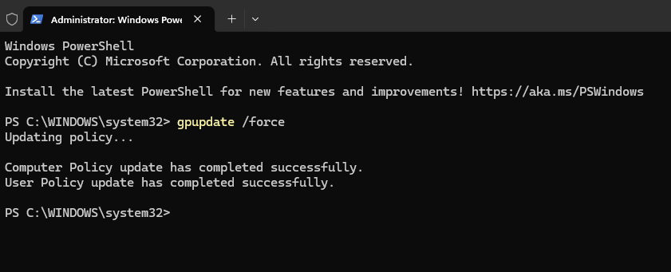
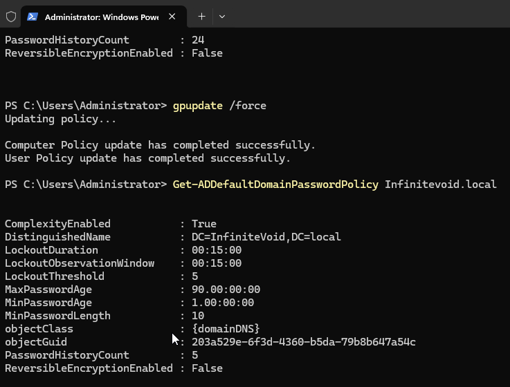
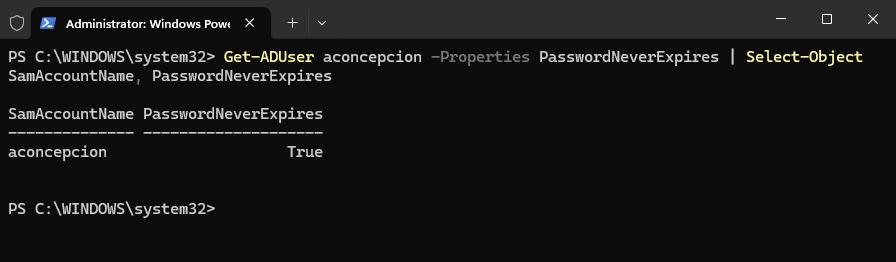
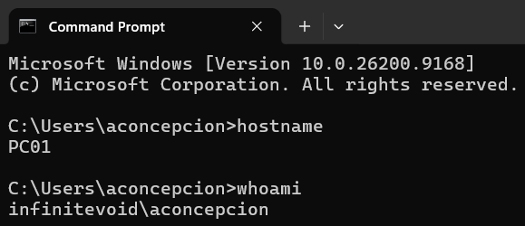
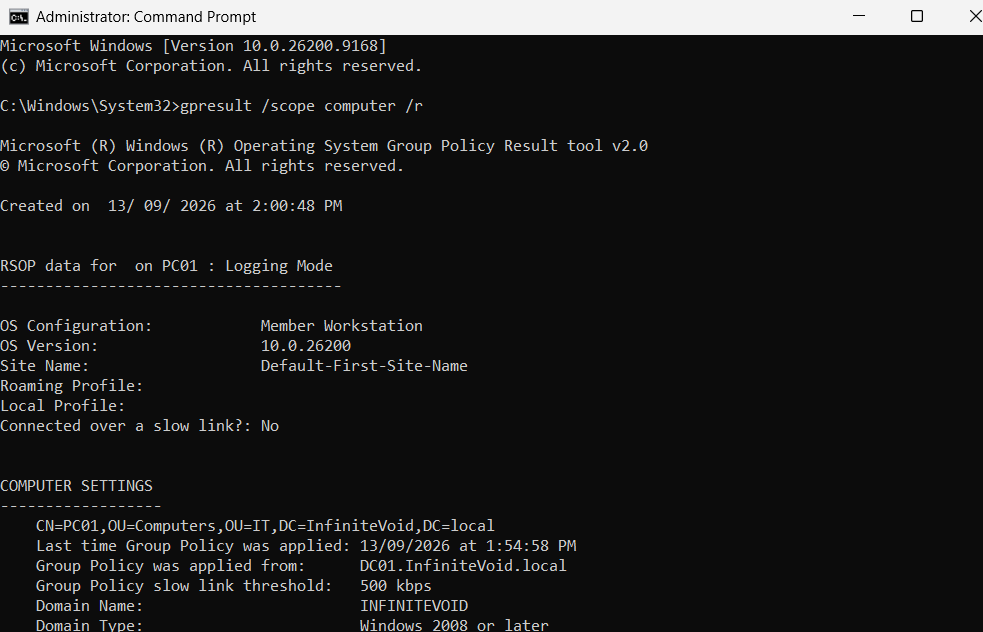
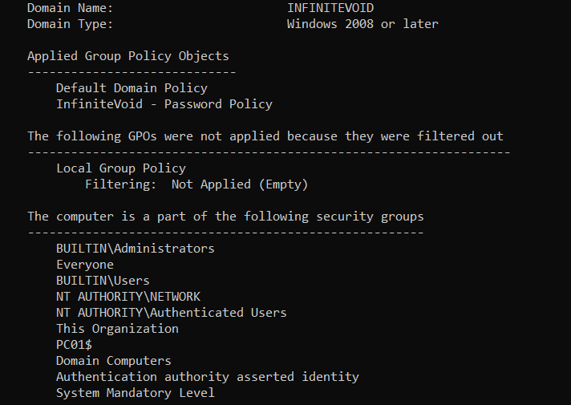
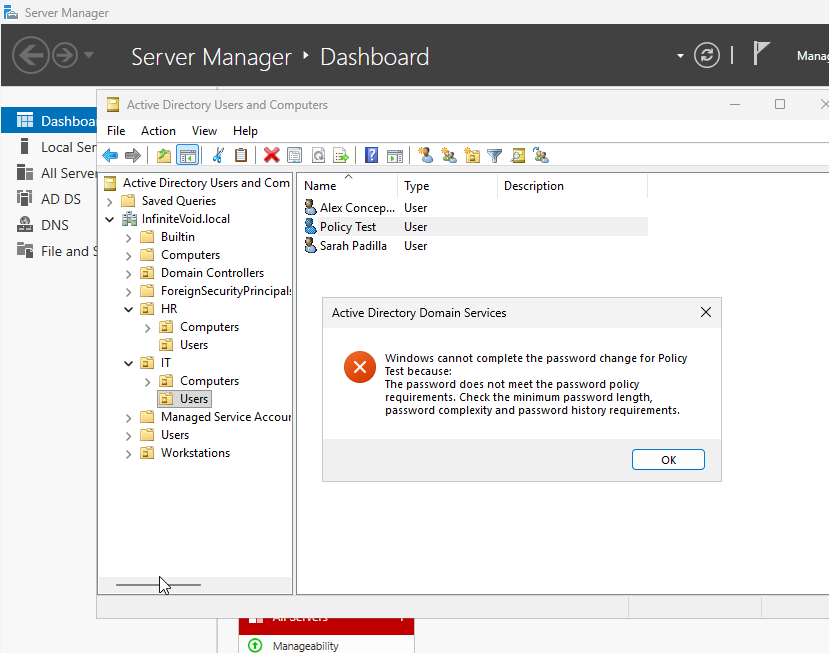
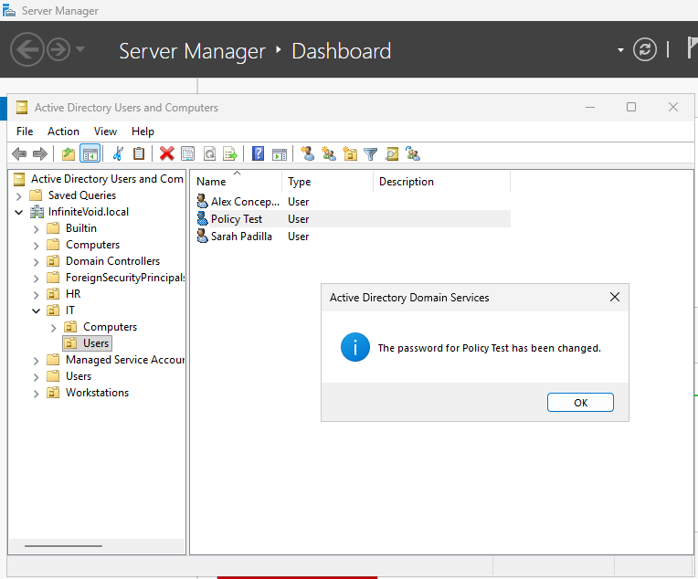
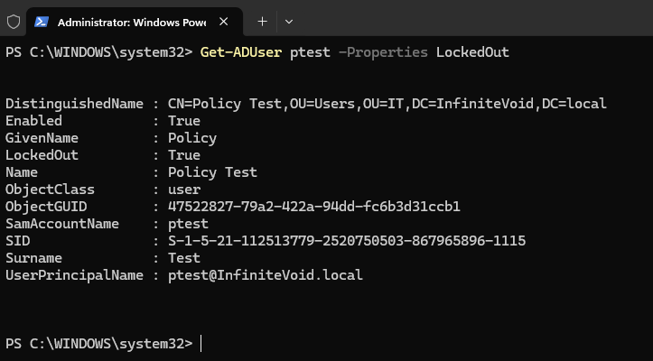

# Phase 3 — User Administration and Initial Group Policy

[Project overview](../READme.md) · [Previous: Active Directory](phase2.md)

**Status:** Complete. User and group administration, PC01 organization, effective domain policy, password reset acceptance/rejection, and test-account lockout are documented with evidence. Validation completed on 13 September 2026.

This phase includes Group Policy work originally planned for Phase 5. Client testing assumes that the Windows 11 VM has already joined the domain; the join procedure still needs its own Phase 4 walkthrough.

## Step 1: Open Active Directory Users and Computers

Sign in to DC01 as `INFINITEVOID\Administrator`. Press **Win + R**, enter `dsa.msc`, and expand `InfiniteVoid.local`.

OUs organize directory objects and provide locations for linking GPOs and delegating administration. Security groups collect accounts for permission assignments. Creating an OU or adding a user to a department group does not itself grant access to shared resources.


## Step 2: Create departmental OUs

Right-click the domain and select **New > Organizational Unit**. Create these three custom top-level OUs:

* `IT`
* `HR`
* `Workstations`

The domain's existing top-level `Users` object is a built-in container, not a fourth custom OU. No additional top-level `Users` OU is shown in the saved hierarchy.

## Step 3: Create sub-OUs

Within both `IT` and `HR`, create `Users` and `Computers` OUs. The custom hierarchy is:

```text
InfiniteVoid.local
├── IT
│   ├── Users
│   └── Computers
├── HR
│   ├── Users
│   └── Computers
└── Workstations
```


Separating users and computers allows their policy settings and administration to be organized independently. GPOs are linked to sites, domains, or OUs; they are not linked directly to individual users or security groups. Security filtering can narrow which users or computers apply a GPO. See Microsoft's [Group Policy processing documentation](https://learn.microsoft.com/en-us/windows-server/identity/ad-ds/manage/group-policy/group-policy-processing).

In this lab, PC01 is ultimately placed in `IT/Computers`. The separate `Workstations` OU is not used for PC01 in the recorded work.

## Step 4: Create domain users

Right-click the appropriate departmental `Users` OU and select **New > User**. Enter the name and logon name, use the `@InfiniteVoid.local` UPN suffix, and set an initial password privately.

| Name | Logon name (SamAccountName) | OU |
| --- | --- | --- |
| Alex Concepcion | `aconcepcion` | `IT/Users` |
| Sarah Padilla | `spadilla` | `IT/Users` |
| Michael Brown | `mbrown` | `HR/Users` |
| Emma Davis | `edavis` | `HR/Users` |

Alex's logon name is corrected to match the saved PowerShell verification screenshot.


**Recorded lab choices:** The notes used a shared example password, selected **Password never expires**, and cleared **User must change password at next logon**. Literal passwords are omitted here. These choices describe the original exercise, not a general account provisioning standard.

**Expiration exception:** Alex's account retains **Password never expires**, matching the original lab setup. Step 8 verifies this exception. The 90-day domain setting was verified by query; this phase did not wait for or simulate password expiration.


## Step 5: Create security groups

Right-click each departmental OU and select **New > Group**.

| Group | Location | Scope | Type |
| --- | --- | --- | --- |
| `IT-Users` | `IT` | Global | Security |
| `HR-Users` | `HR` | Global | Security |

These groups will support permission assignments in later work. Resource permissions have not yet been configured in this phase.

## Step 6: Add group members

Open each group's **Properties > Members > Add**, select the accounts, and confirm:

| Group | Members |
| --- | --- |
| `IT-Users` | Alex Concepcion, Sarah Padilla |
| `HR-Users` | Michael Brown, Emma Davis |


## Step 7: Verify users and membership

Open PowerShell as Administrator on DC01. The recorded user query is:

```powershell
Get-ADUser -Filter * | Select-Object Name, SamAccountName
```

The screenshot shows all four lab users alongside the built-in accounts.


Check IT group membership:

```powershell
Get-ADGroupMember -Identity 'IT-Users'
```


For reference, the equivalent HR query is below. HR membership is shown in Step 6; a separate PowerShell result for this query was not captured.

```powershell
Get-ADGroupMember -Identity 'HR-Users'
```

## Step 8: Configure password and account lockout policy

### Create the domain-linked GPO

1. Press **Win + R** and enter `gpmc.msc`.
2. Expand **Forest: InfiniteVoid.local > Domains > InfiniteVoid.local**.
3. Right-click the domain and select **Create a GPO in this domain, and Link it here**.
4. Name it `InfiniteVoid - Password Policy`.


The lab uses a separate GPO linked at the domain root. It must take precedence over conflicting settings in the Default Domain Policy. During validation, the Default Domain Policy was at link order 1 and the custom policy at order 2. The correction was to move the custom policy to order 1, then refresh policy on DC01. The effective-policy query below confirmed the intended values after refresh. See Microsoft's [account policy guidance](https://learn.microsoft.com/en-us/previous-versions/windows/it-pro/windows-10/security/threat-protection/security-policy-settings/account-policies).

### Configure password settings

Right-click the GPO, select **Edit**, and navigate to:

**Computer Configuration > Policies > Windows Settings > Security Settings > Account Policies > Password Policy**.

The saved screenshot records these exercise settings:

| Policy | Setting |
| --- | --- |
| Enforce password history | 5 passwords remembered |
| Maximum password age | 90 days |
| Minimum password age | 1 day |
| Minimum password length | 10 characters |
| Password must meet complexity requirements | Enabled |


### Configure account lockout settings

Under **Account Policies > Account Lockout Policy**, configure:

| Policy | Setting |
| --- | --- |
| Account lockout threshold | 5 invalid logon attempts |
| Account lockout duration | 15 minutes |
| Reset account lockout counter after | 15 minutes |


### Recorded client policy check

The notes describe signing in to the Windows 11 VM as Alex and refreshing policy. In Command Prompt, use:

```cmd
gpupdate /force
gpresult /r
```


The saved result shows `INFINITEVOID\aconcepcion`, Alex's `IT/Users` OU, and policy processing from DC01. The visible section is **User Settings**; it does not establish that the domain password and lockout settings are effective.

This earlier report shows the Windows computer name `DESKTOP-4F5OJ04`. The later hostname and computer-policy checks below confirm the current name is `PC01`. The historical rename/join procedure remains part of the Phase 4 walkthrough.

### Completed validation

The following checks were completed during the lab walkthrough. Screenshots distinguish configured settings from observed results.

On DC01, policy was refreshed with `gpupdate /force` after correcting precedence. The verification commands were:

```powershell
Get-ADDefaultDomainPasswordPolicy -Identity 'InfiniteVoid.local' |
    Select-Object ComplexityEnabled, MinPasswordLength, PasswordHistoryCount,
        MinPasswordAge, MaxPasswordAge, LockoutThreshold,
        LockoutDuration, LockoutObservationWindow

Get-ADUserResultantPasswordPolicy -Identity 'aconcepcion'

Get-ADUser -Identity 'aconcepcion' -Properties PasswordNeverExpires |
    Select-Object SamAccountName, PasswordNeverExpires
```

Compare the domain policy output with the tables above. The [default-domain policy command](https://learn.microsoft.com/en-us/powershell/module/activedirectory/get-addefaultdomainpasswordpolicy?view=windowsserver2025-ps) retrieves the domain's default settings. The [resultant-password-policy command](https://learn.microsoft.com/en-us/powershell/module/activedirectory/get-aduserresultantpasswordpolicy?view=windowsserver2025-ps) checks for a fine-grained password policy applying to Alex; if it returns none without an error, use the domain default policy for comparison.

#### Effective domain policy and account exception

The initial query returned a minimum length of 7, history of 24, maximum age of 42 days, and lockout threshold of 0. After correcting link precedence and refreshing policy on DC01, the query returned all intended settings:

| Setting | Verified value |
| --- | --- |
| ComplexityEnabled | True |
| MinPasswordLength | 10 |
| PasswordHistoryCount | 5 |
| MinPasswordAge | 1 day |
| MaxPasswordAge | 90 days |
| LockoutThreshold | 5 |
| LockoutDuration | 15 minutes |
| LockoutObservationWindow | 15 minutes |





The resultant-password-policy command returned no output for Alex, as reported during the walkthrough. The account query confirmed `PasswordNeverExpires = True`; that original lab exception was retained.



#### Client identity and applied computer policies

On the Windows 11 client, the following commands were run:

```cmd
hostname
whoami
```

The results show `PC01` and `infinitevoid\aconcepcion`.



From an elevated Command Prompt:

```cmd
gpresult /scope computer /r
```

The report confirms PC01 is in `IT/Computers`, receives policy from `DC01.InfiniteVoid.local`, and lists both Default Domain Policy and InfiniteVoid - Password Policy as applied. This is supporting evidence; the domain query above verifies the effective password and lockout values.





#### Password reset and lockout tests

A dedicated test user named **Policy Test** was created in `IT/Users`. Its actual logon name is **`ptest`**, as confirmed by the account query below.

1. In ADUC on DC01, **Reset Password** was used to attempt an 8-character password containing mixed character types. Windows rejected it with a password-policy requirements message.
2. A new private password of at least 10 characters with mixed character types was submitted. Windows confirmed the password was changed.
3. Incorrect domain sign-in attempts were made for the test account on the Windows 11 client. DC01 was then queried to verify the account's locked-out state.

| Test | Expected result | Observed result |
| --- | --- | --- |
| Below-minimum password reset | Rejected | Password-policy error displayed |
| Compliant password reset | Accepted | Successful password-change confirmation |
| Failed sign-ins followed by account query | Account locked out | `LockedOut = True` for `ptest` |





The lockout verification command on DC01 was:

```powershell
Get-ADUser ptest -Properties LockedOut
```



The screenshots establish password reset rejection/acceptance and an actual account lockout. They do not independently measure the exact number of failed attempts or elapsed unlock time. The threshold and timer values are verified by the domain policy query. Password aging and history were verified as settings, not through separate behavioral tests.

## Step 9: Organize PC01 in Active Directory

On DC01, open `dsa.msc` and locate the `PC01` computer account in the domain's built-in **Computers** container. Right-click it, select **Move**, and choose **IT > Computers**.

The saved screenshot shows `PC01` in that OU:


The original container will be empty only if no other computer accounts remain there. Moving the AD object changes its OU location; it does not rename the Windows client.

## Outcome and next phases

Phase 3 is complete for the documented scope: directory organization, users and groups, initial Group Policy, effective-policy verification, password reset testing, and observed account lockout. PC01's current name and OU are confirmed, and Alex's original expiration exception is recorded.

Phase 4 will document the client rename, DNS setup, domain join, and authentication procedure. Additional client policies belong to Phase 5, file services to Phase 6, and automation to Phase 7.
