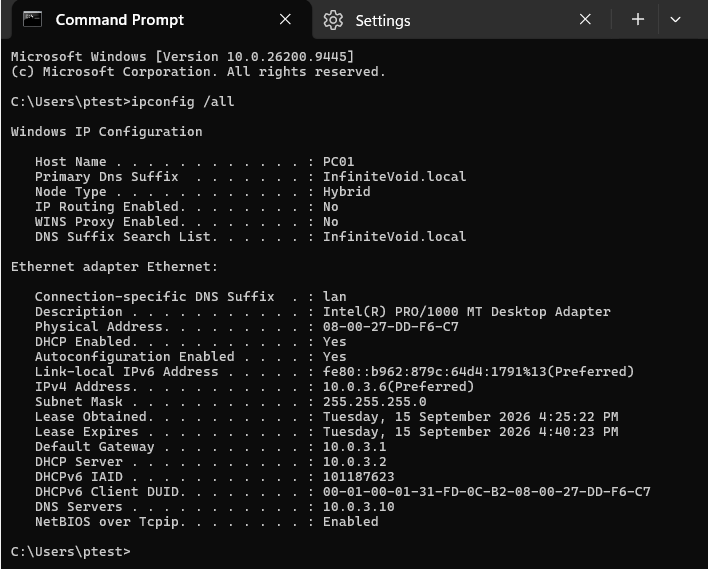
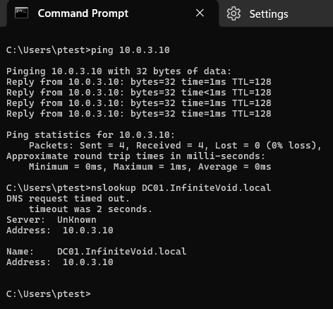
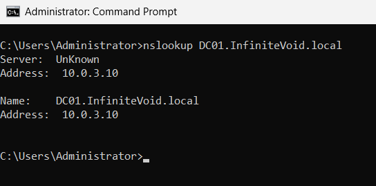
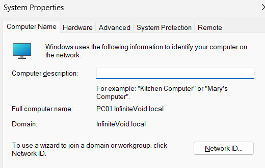

# Phase 4 — Windows Client

[Project overview](../READme.md) · [Previous: Users and Group Policy](phase3.md)

**Status:** Complete for the documented client setup and verification scope. Networking, forward DNS resolution, domain membership, and existing domain-user evidence are recorded. Checks performed on 15 September 2026.

PC01 was already joined before this phase. The setup instructions below describe how to reproduce the intended configuration on a new client; the rename and join were not repeated during this walkthrough. Historical screenshots of the original rename/join wizard are unavailable.

## Screenshot directory

Phase 4 screenshots are stored in [Screenshots/phase4](../Screenshots/phase4/).

```text
Screenshots/phase4/
├── ipconfig.png
├── pingandnslookup.png
├── DNSFollowUp.png
└── DomainMembership.png
```

The domain-session screenshot in Step 5 is reused from [Phase 3](../Screenshots/phase3/pc01verification.png).

## Step 1: Client network configuration

Start DC01 (Windows Server) and PC01 (Windows 11 Enterprise) in VirtualBox. Both use the same NAT Network established in Phase 1.

For a new client, open `ncpa.cpl`, right-click **Ethernet > Properties**, and open **Internet Protocol Version 4 (TCP/IPv4)**. Keep automatic IP assignment for this lab and set the preferred DNS server to `10.0.3.10`, the AD DNS server on DC01. This is a reproduction instruction; the screenshot verifies the resulting settings, not how DNS was originally assigned.

On PC01, run:

```cmd
ipconfig /all
```

| Setting | Observed value |
| --- | --- |
| Hostname | PC01 |
| Primary DNS suffix | InfiniteVoid.local |
| DHCP enabled | Yes |
| IPv4 address | 10.0.3.6 |
| Subnet mask | 255.255.255.0 |
| Default gateway | 10.0.3.1 |
| DHCP server | 10.0.3.2 |
| DNS server | 10.0.3.10 |

The client address is a DHCP lease and can change. DC01 remains at its static address.



## Step 2: Connectivity and DNS verification

On PC01, run:

```cmd
ping 10.0.3.10
nslookup DC01.InfiniteVoid.local
```

**Observed:** All four pings received replies with 0% loss. The forward DNS query returned `DC01.InfiniteVoid.local` at `10.0.3.10`, although an initial DNS timeout appeared.



Repeating the query with an explicit DNS server initially produced the same behavior. A reverse lookup was then requested:

```cmd
nslookup 10.0.3.10 10.0.3.10
```

The user reported a **non-existent domain** response, consistent with no reverse PTR record for the address. That explains why nslookup could not display the DNS server's name. It does not establish the cause of the earlier timeout.

A later supplied forward-lookup screenshot returns the correct address without a timeout. Its prompt shows Administrator and does not identify the machine, so it is retained as follow-up evidence rather than proof that PC01's intermittent timeout was resolved.



**Recorded limitation:** Forward resolution succeeded from PC01. Reverse DNS was unavailable, and the initial timeout's cause was not established. This phase does not claim a complete DNS health assessment.

## Step 3: Client naming and domain join procedure

The following is the procedure for a new, unjoined Windows 11 Enterprise client. PC01 already had this resulting configuration, so no leave/rejoin operation was performed.

1. Sign in using a local administrator account.
2. Confirm the client uses DC01 for DNS and can resolve the domain controller as described above.
3. Press **Win + R**, enter `sysdm.cpl`, and select **Computer Name > Change**.
4. Set the computer name to `PC01`, confirm the change, and restart when prompted. For a separate new lab client, choose a unique name rather than reusing the existing PC01 account.
5. Reopen **System Properties > Computer Name > Change**.
6. Under **Member of**, select **Domain** and enter `InfiniteVoid.local`.
7. Supply a domain account authorized to join computers, such as the lab's `INFINITEVOID\Administrator`, when prompted. Keep its password private.
8. Confirm the domain welcome message and restart the client.

This procedure follows Microsoft's [domain join instructions](https://learn.microsoft.com/en-us/windows-server/identity/ad-ds/manage/join-computer-to-domain). It is a reproduction guide, not a claim that each wizard screen was captured during this phase.

## Step 4: Verify current domain membership

On PC01, open `sysdm.cpl` and select the **Computer Name** tab.

| Field | Verified value |
| --- | --- |
| Full computer name | PC01.InfiniteVoid.local |
| Domain | InfiniteVoid.local |



The earlier Phase 3 report used a generated Windows hostname. This screenshot and the later hostname query confirm the current name. They do not reconstruct the exact date or original sequence of the rename.

## Step 5: Domain-user sign-in evidence

After joining a new client, choose **Other user** at sign-in and enter a domain account such as `INFINITEVOID\aconcepcion` with its private password. In that session, run:

```cmd
hostname
whoami
```

Existing Phase 3 evidence shows `PC01` and `infinitevoid\aconcepcion`; it is reused here instead of repeating the same screenshot. This demonstrates the session's domain identity, not a separate fresh online-authentication or secure-channel test.


Phase 3 also records PC01 in `IT/Computers` and policy processing from DC01. See [Phase 3](phase3.md) for those results.

## Outcome

PC01 has the intended network settings, can reach DC01, resolves DC01's forward DNS name, and is joined to `InfiniteVoid.local`. The client setup procedure is now documented, with existing domain-session evidence linked. The DNS observation above remains explicit rather than being presented as repaired.

Next: Phase 5 — additional Group Policy configuration and validation.
